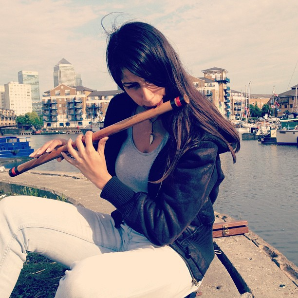
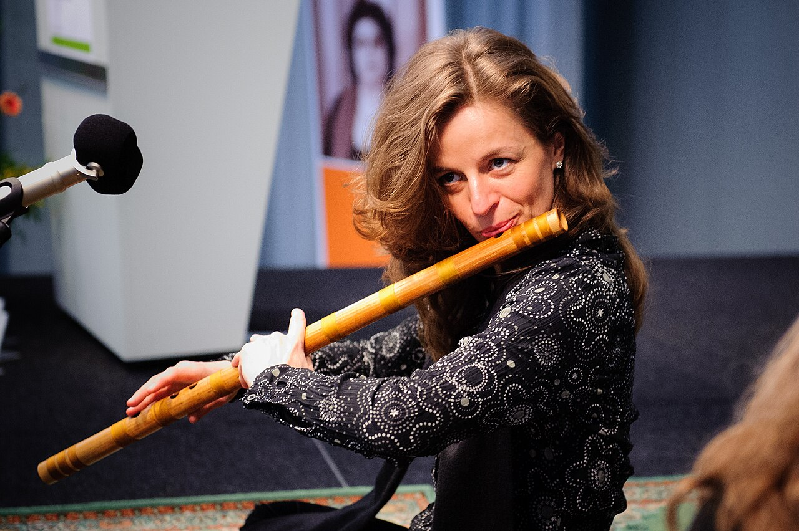

# Learn Basuri — Hold & posture

# Hold & posture

The bansuri is side-blown. Right-handed setup is standard in most tutorials: flute extends to your right.

## Hands (right-handed)

Photo: Gavin Mackintosh · [Commons](https://commons.wikimedia.org/wiki/File:A_bansuri_player_Jaspreet,_flute_classical_Indian_music_instrument.jpg) · CC BY 2.0

**Left hand** (upper three holes, nearest the blowing hole): index, middle, ring. Thumb rests underneath for support — it does not cover a hole on a 6-hole bansuri.

**Right hand** (lower three holes): index, middle, ring. Thumb balances from below the same way.

### Which part of the finger

Cover each hole with the **fleshy pad** on the underside of the first joint (the soft meat just behind the tip) — the same pad you would use to press a piano key firmly. Do **not** poke the hole with the fingertip end or the nail; do not curl so only a thin edge touches.

- **Left hand** — drop the three pads flat onto holes 1–3. Keep fingers gently curved (like holding a small ball). The left **index** pad is especially important: it must seal hole 1 fully for Ga, and later slide for [shuddha Ma](swaras.html#ma) half-cover.
- **Right hand** — same pad contact on holes 4–6. Reach without stretching the wrist sideways; bring the flute to the hand a little if the stretch is long.

A tiny leak kills the tone. If air hisses from a “closed” hole, press the pad more squarely — do not squeeze harder with the whole hand.

## Balance

Photo: Heinrich-Böll-Stiftung · [Commons](https://commons.wikimedia.org/wiki/File:A_bansuri_player_Stephanie_Bosch,_flute_side_blown_wind_instrument_India.jpg) · CC BY-SA 2.0

Three-point balance: lip at the blowing hole, left thumb under, right thumb under. Light clamp — elbows free, sit tall.

## Next

[First sound](first-sound.html)
